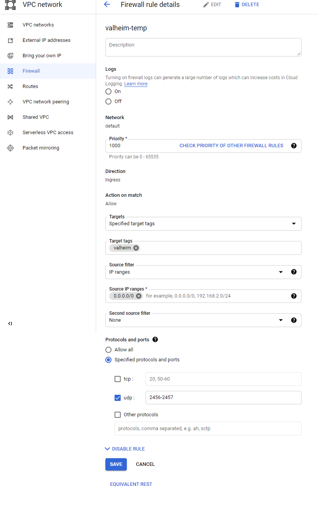

# How to run Valheim Server in Google Cloud (90 days free trial)
In this Tutorial you will learn how to setup a Valheim Dedicated Server in the Google Cloud

Some notes before we start:
- The server is free for 90 days only. After that you will have to pay a monthly fee based on your VM configuration and up-time (see https://cloud.google.com/compute/vm-instance-pricing for details)
- You should be familiar with the Unix Shell as most of the initial setup and maintenance is done using SSH (Secure Shell)

## Start Google Cloud Trial
- Goto https://console.cloud.google.com/ and login to your google account
- Follow the instructions to setup your free trial. You will need to enter payment info (PayPal or Credit Card) - but you will not be charged before explicitly activating billing in the Cloud Console.

## Create VM
- Goto https://console.cloud.google.com/compute/instances 
- Click "Create Instance"
- Enter a suitable name for your VM like "valheim"
- Select a region based on your players' location
- Select a machine configuration - "e2-small" is sufficient for two players based on my experience if you enable "Memory Swapping" (see below).
You can also select a bigger configuration, as your first 90 days are free nonetheless.
- The default boot disk (10GB / Debian 10) is fine
- Enter the Network tag "valheim" under "Networking"
- Click "Create"


<br/>
The VM should appear as online after some seconds:


## Port Forwarding
You need to forward the UDP ports 2456-2458 in the firewall settings to allow players to connect:
- Goto https://console.cloud.google.com/networking/firewalls
- Click "Create Firewall Rule"
- Enter a suitable name like "valheim"
- Select "Specified target tags" as Targets and enter the tag "valheim" (same as the VM's network tag)
- Select "IP ranges" as Source filter and enter the range "0.0.0.0/0"
- Check "udp" and enter the range "2456-2458"
- Click "Create"



## Optional: Setup Static IP
If you want your server to always have the same IP:
- Goto https://console.cloud.google.com/networking/addresses
- Click "Reserve" next to the IP address currently used by your VM 


❗ **Note:** Static IPs increase the monthly fee (after trial phase) 

## Optional: Schedule Start/Stop
The start_server_custom.sh script (see below) automatically performs a worlds backup on shutdown. 
So to perform a backup at least once a day, you should schedule an automatic shutdown.
You can skip this step, if you don't want automatic backups and want the VM to run 24/7 (ok during the free trial)
- Open your VM from https://console.cloud.google.com/compute/instances  
- Select "Instance Schedule" and click "Create Schedule"
- Enter a suitable name like "stop-at-4am"
- Select your region
- Enter a stop time
- Optional: Enter a start time
- Enter your timezone
- Enter "Repeat daily" as frequency
- Click "Create"


<br/>

Select the created schedule and add your VM to it:


## Connect via SSH
For the following steps you need to connect to your VM via SSH
- Goto https://console.cloud.google.com/compute/instances 
- Click "SSH" next to your VM

The remote shell should open in a new browser window:
<br/>


## Install SteamCMD
Execute the following commands to install [SteamCMD](https://developer.valvesoftware.com/wiki/SteamCMD#Linux):
- Create Steam directory: `mkdir ~/Steam && cd ~/Steam`
- Install SteamCMD dependencies: 
```
sudo apt install lib32gcc1
sudo apt install zip
sudo apt install unzip
```
- Download and extract SteamCMD: `curl -sqL "https://steamcdn-a.akamaihd.net/client/installer/steamcmd_linux.tar.gz" | tar zxvf -`

## Install Valheim Dedicated Server
Execute the following SteamCMD commands to install the Valheim Dedicated Server:
- Start SteamCMD: `./steamcmd.sh `
- Login: `login anonymous`
- Install [Valheim Server](https://steamdb.info/app/896660/): `app_update 896660`
- Exit SteamCMD: `exit`

## Create Swap File
You should create a [Swap file](https://linuxize.com/post/create-a-linux-swap-file/) to allow the OS to swap memory to the disk, when the system runs low on memory (otherwise your Valheim Server might crash)

Enter the following commands to create and register the swap file:
```bash
sudo fallocate -l 1G /swapfile
sudo chmod 600 /swapfile
sudo mkswap /swapfile
sudo swapon /swapfile
sudo vim /etc/fstab
```
The last command opens the file /etc/fstab for editing using "vim". Hit "i" on your keyboard to start editing and add the following line at the end: `/swapfile swap swap defaults 0 0`

Then hit "Escape" and type `:wq!` to save the changes to the file.

## Optional: Install MegaCMD
You can skip this step, if you don't want the server to automatically backup your worlds to the [mega.nz Cloud](https://mega.nz/)
- Download the Debian 10 Version of MegaCMD: https://mega.nz/cmd 
- Upload the package to your VM using the SSH window (cog symbol in the top/right corner and than "Upload File")
- Install the uploaded package: `sudo apt install ~/megacmd-Debian_10.0_amd64.deb`
- Then login to your Mega.nz account: `mega-login [email] [password]` 
- Note: the session stays alive even after system reboot - you can manually logout using `mega-logout` or by terminating the session in the mega.nz web interface.
- Enter `mega-session` to get the session id (you will need this later to setup the backup)
- Create a directory named "valheim.backup" in your cloud

## Optional: Upload your world
You can upload your existing world to the VM:
- ZIP your existing world located at C:\Users\\[user]\AppData\LocalLow\IronGate\Valheim\worlds  
❗ the root directory within the zip must be "worlds" for the following to work
- Upload the zip using the SSH window (cog symbol in the top/right corner and than "Upload File")
- Create the Valheim config directory: `mkdir -p ~/.config/unity3d/IronGate/Valheim`
- Navigate to the directory: `cd ~/.config/unity3d/IronGate/Valheim`
- Unzip the uploaded worlds: `unzip ~/worlds.backup.2021.09.25_02.04.49.zip`

## Setup Dedicated Server Daemon
You should register the Valheim Dedicated Server as a "Daemon" to automatically start the server when your VM boots up and to cleanly(!) stop the server when the VM shuts down.  
Otherwise your world might get corrupted when the VM is shut down.  

For this you need two scripts: <a href="./start_server_custom.sh">start_server_custom.sh</a> and <a href="./valheim.sh">valheim.sh</a> (download these to your local PC: https://github.com/Chris-D-Turk/Valheim.Google.Cloud/archive/refs/heads/master.zip)  
The start_server_custom.sh is a modified version of the start_server.sh that is shipped with the Valheim Dedicated Server.  
The valheim.sh is the actual "Daemon" that is run by the OS on startup/shutdown.  

Upload both scripts to your VM using the SSH window (cog symbol in the top/right corner and than "Upload File")  
Then move the scripts to the right location and register the daemon:
```bash
mv ~/start_server_custom.sh ~/Steam/steamapps/common/Valheim\ dedicated\ server/
chmod u+x ~/Steam/steamapps/common/Valheim\ dedicated\ server/start_server_custom.sh 

sudo mv ~/valheim.sh /etc/init.d
chmod u+x /etc/init.d/valheim.sh 
sudo update-rc.d valheim.sh defaults
```

Now you should be able to query the daemon status using: `sudo systemctl status valheim.service`  
You should see the following output:
```
● valheim.service - LSB: valheim service
   Loaded: loaded (/etc/init.d/valheim.sh; generated)
   Active: inactive (dead)
     Docs: man:systemd-sysv-generator(8)
```

You need to create two additional "init" scripts to specify your environment-specific parameters  
**start_server_custom_init.sh**
```bash
cd ~/Steam/steamapps/common/Valheim\ dedicated\ server/
vim start_server_custom_init.sh
```
Enter the following parameters:
```bash
#! /bin/bash
server_name=""
server_password=""
world_name=""
backup_enabled=true
mega_session=""
```
- **server_name**: Your server's name how it appears in the in-game server browser
- **world_name**: Your world's name (must match the name of your world uploaded in the previous step)
- **server_password**: The password needed to connect in-game (Minimum password length is 5 characters & Password cant be in the server name)
- **backup_enabled**: Set this to 'false', if you don't want to backup your worlds to the mega.nz cloud
- **mega_session**: This is the mega.nz login session ID used to upload world backups (see step "Install MegaCMD")

Then hit "Escape" and type `:wq!` to save the changes to the file.  
Make the file executable: `chmod u+x start_server_custom_init.sh`

**valheim_init.sh**

```bash
cd /etc/init.d
sudo vim valheim_init.sh
```
Enter the following parameters:

```bash
#! /bin/bash
daemon_user=""
valheim_basedir=/home/$daemon_user/Steam/steamapps/common/Valheim\ dedicated\ server
valheim_pidfile=$valheim_basedir/valheim.pid
daemon_exec=/bin/bash
daemon_args=$valheim_basedir/start_server_custom.sh
```
- **daemon_user**: this must match your SSH username 
    - your username is displayed in the SSH window at the start of the input line (copy only the part before the @-symbol)

Then hit "Escape" and type `:wq!` to save the changes to the file.  
Make the file executable: `sudo chmod u+x valheim_init.sh`


Start the daemon using: `sudo systemctl start valheim.service`  
Check the status again: `sudo systemctl status valheim.service`  
The daemon should appear as 'running':
```
● valheim.service - LSB: valheim service
   Loaded: loaded (/etc/init.d/valheim.sh; generated)
   Active: active (running) since Sun 2021-09-26 15:34:43 UTC; 4min 7s ago
     Docs: man:systemd-sysv-generator(8)
  Process: 1584 ExecStart=/etc/init.d/valheim.sh start (code=exited, status=0/SUCCESS)
    Tasks: 37 (limit: 2310)
   Memory: 1.6G
   CGroup: ...
```

Now you should be able to connect to your server in-game using the External IP shown at: https://console.cloud.google.com/compute/instances 

## Troubleshoot
Useful commands:
- query the Valheim Daemon status: `sudo systemctl status valheim.service` 
- start/stop the Valheim Daemon: `sudo systemctl start/stop valheim.service` 
- check the logs: `cat /var/log/messages | grep -i "valheim-daemon"`
- view all processes (the server should appear as 'valheim_server'): `top`